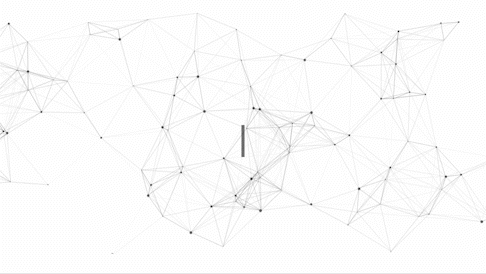
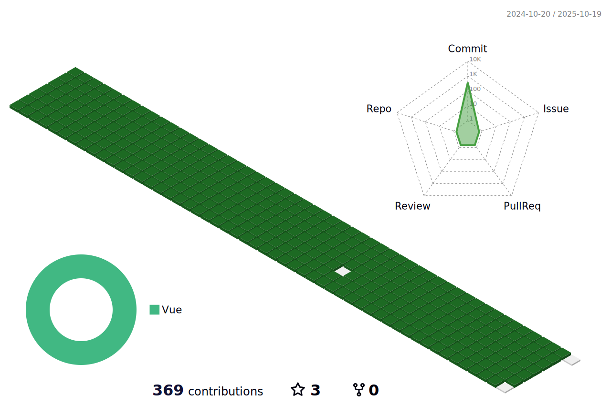

<p align="center">

</p>

## About Me <br>


## ⚡ Stack <br>
<div align = "center">
  
Programming Languages 

<!-- python -->

  
<!-- C++ -->

  
<!-- js -->


  
front end
<!-- React -->

  
<!-- vue -->

  
  
  
Data Science
<!-- numpy -->


<!-- OpenCV -->

  
<!-- Matplotlib -->


Hardware
<!-- Raspberry pi -->


<!-- arduino -->


**Server**
<!-- docker -->


<!-- ncp -->


**Hardware**

AI (Artificial Intelligence)
<!-- tensorflow -->


Server Platform
<!-- gcp -->


<!-- amazon s3 -->


<!-- amazon ec2 -->


<!-- aws -->


<!-- ncp -->


etc.. <br>


 
</div>
    
Skill
- Google Certified Educator Level 2
- 

## Where To Find Me? <br>

<center>

<p><a href="https://github.com/Dev-minu" target="_blank"></a> 
<a href="https://www.linkedin.com/in/minwoo-cho/(https://www.linkedin.com/in/minwoo-cho/)" target="_blank"></a> 
<a href="https://facebook.com/whalsdn1003" target="_blank"></a>
<a href="https:instagram.com/minu__haru" target="_blank"></a>
  
<a href="mailto:iam@minu.ac" target="_blank"></a>
<a href="https://velog.io/@minuac" target="_blank"></a>
  
</center>

github page -> prepare

<!-- 3d stat -->
  
  

  
<details>
  <summary>Click for Stat</summary>

  
[](https://solved.ac/whalsdn1003/)
[](https://github.com/anuraghazra/github-readme-stats)
  
</details>

<details>
  <summary>Click for waka stat</summary>
    <!--START_SECTION:waka-->


**I'm a Night 🦉** 

```text
🌞 Morning                27 commits          █░░░░░░░░░░░░░░░░░░░░░░░░   02.11 % 
🌆 Daytime                45 commits          █░░░░░░░░░░░░░░░░░░░░░░░░   03.51 % 
🌃 Evening                22 commits          ░░░░░░░░░░░░░░░░░░░░░░░░░   01.72 % 
🌙 Night                  1188 commits        ███████████████████████░░   92.67 % 
```


📊 **This Week I Spent My Time On** 

```text
🕑︎ Time Zone: Asia/Seoul

💬 Programming Languages: 
No Activity Tracked This Week

🔥 Editors: 
No Activity Tracked This Week

💻 Operating System: 
No Activity Tracked This Week
```


 Last Updated on 21/10/2025 18:46:55 UTC
<!--END_SECTION:waka-->
</details>

README language <br>
[ko](https://github.com/Dev-minu/Dev-minu/blob/main/lang/README_kr.md) / [jp](https://github.com/Dev-minu/Dev-minu/blob/main/lang/README_jp.md)
  
<!-- hits -->
[](https://hits.seeyoufarm.com/)


etc..
https://minu.ac

[](https://github.com/ryo-ma/github-profile-trophy)


Last update 22/08/23
